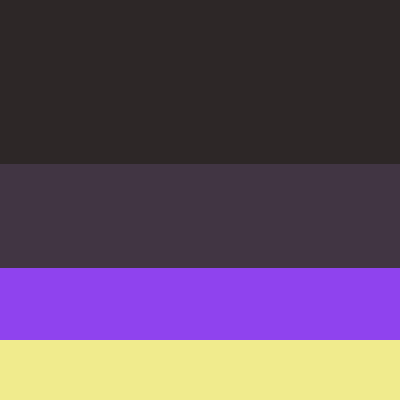

# Portafolio
## Gustavo Cruz

## Sitio Web
Puedes ver mi portafolio en los siguientes enlaces:
- **Netlify**: [Portafolio](https://comforting-choux-ae972c.netlify.app/)
- **GitHub Pages**: [Portafolio](https://g2309.github.io/Portfolio/)

## Tecnologías Utilizadas
En la creación de mi portafolio, utilicé varias tecnologías. A continuación, explico cada una de ellas y cómo contribuyen al proyecto:

### React
**React** es una biblioteca de JavaScript para construir interfaces de usuario. Utiliza un enfoque basado en componentes, lo que facilita la creación de aplicaciones interactivas y dinámicas. En mi portafolio, React me permitió dividir la interfaz en componentes reutilizables, como el encabezado, el carrusel de proyectos y las secciones de contacto. Esto no solo mejora la organización del código, sino que también facilita el mantenimiento y la escalabilidad del sitio.

### Vite
**Vite** es una herramienta de construcción y desarrollo rápido para proyectos de front-end. A diferencia de herramientas tradicionales como Webpack, Vite utiliza una arquitectura basada en ES modules y ofrece una experiencia de desarrollo extremadamente rápida y eficiente. En mi proyecto, Vite permite un arranque del servidor de desarrollo casi instantáneo y una recarga en caliente (hot module replacement) que acelera el proceso de desarrollo, haciendo que los cambios en el código se reflejen de inmediato en el navegador.

### GitHub Pages
**GitHub Pages** es un servicio de hospedaje de sitios estáticos directamente desde un repositorio de GitHub. Es ideal para alojar portafolios personales, documentación de proyectos y otros sitios estáticos. Para mi portafolio, GitHub Pages proporciona una forma sencilla y gratuita de desplegar y mantener el sitio, asegurando que esté siempre disponible y actualizado con el contenido más reciente del repositorio.

### Netlify
**Netlify** es una plataforma para el despliegue y administración de aplicaciones web modernas. Ofrece características como despliegue continuo, integración con GitHub, y servicios serverless. Utilicé Netlify para desplegar mi portafolio debido a su facilidad de uso, capacidad de manejar rutas dinámicas y formularios sin necesidad de un servidor backend, y su capacidad para integrar automáticamente cambios desde el repositorio de GitHub, lo que asegura que mi sitio esté siempre sincronizado con los últimos cambios de código.

## Información del Portafolio
El portafolio se ejecuta en servidores tanto de GitHub Pages como de Netlify, asegurando redundancia y disponibilidad en múltiples plataformas. El sitio presenta mi información de contacto, un resumen de mis conocimientos en programación, y una galería de proyectos en los que he trabajado, cada uno con descripciones detalladas, imágenes y enlaces a los repositorios de código correspondientes. 

### Paleta de Colores
La paleta de colores utilizada en el diseño del portafolio es crucial para crear una experiencia visualmente atractiva y coherente. A continuación, detallo el propósito de cada color en la paleta:

- **--background: #262121;**
  Este color oscuro sirve como fondo principal del sitio, proporcionando un contraste adecuado con los elementos de texto y destacando los componentes interactivos del portafolio. Un fondo oscuro también ayuda a reducir la fatiga visual en entornos con poca luz.

- **--background-alt: #3D3240;**
  Utilizado para áreas secundarias y de contraste dentro del sitio, como secciones alternas o tarjetas de contenido. Este color complementario ayuda a segmentar visualmente el contenido sin distraer la atención del usuario.

- **--border: #A47ABF;**
  Este color se utiliza para bordes y separadores, ayudando a definir límites entre distintos elementos y secciones del sitio. Los bordes visibles mejoran la estructura y la legibilidad del contenido.

- **--focus: #8D44F2;**
  Un color vibrante utilizado para resaltar elementos interactivos como botones, enlaces y elementos en los que se hace foco. Este color asegura que los usuarios puedan identificar rápidamente las áreas interactivas del sitio, mejorando la usabilidad.

- **--text: #F2EC91;**
  Este color claro se utiliza para el texto principal, creando un contraste claro y legible contra el fondo oscuro. La elección de un color de texto suave reduce la tensión visual y mejora la experiencia de lectura prolongada.

La combinación de estos colores crea una experiencia visual armónica y profesional, asegurando que el contenido del portafolio sea accesible y atractivo para los usuarios.

